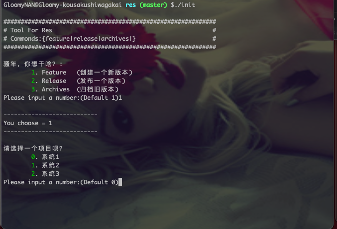

# README

此项目为日常业务开发资源存放库，结构如下：

## tool使用



1. Feature: 根据给定名称创建一个版本，包含`assets/`、`version.md`、`test.md`、`relase.md`、`alter.sql`等
2. Release: 将`pre`开通的文件夹修改为`v`开头；
3. Archives: 根据给定日期将文件夹归档；

```bash
.template           # 立项模板
├── alter.sql       # 上线语句
├── assets          # 资源文件夹
│   └── README.md   # 说明
├── relase.md       # 上线文档
├── test.md         # 提测文档
└── version.md      # 需求评审及技术方案设计
```